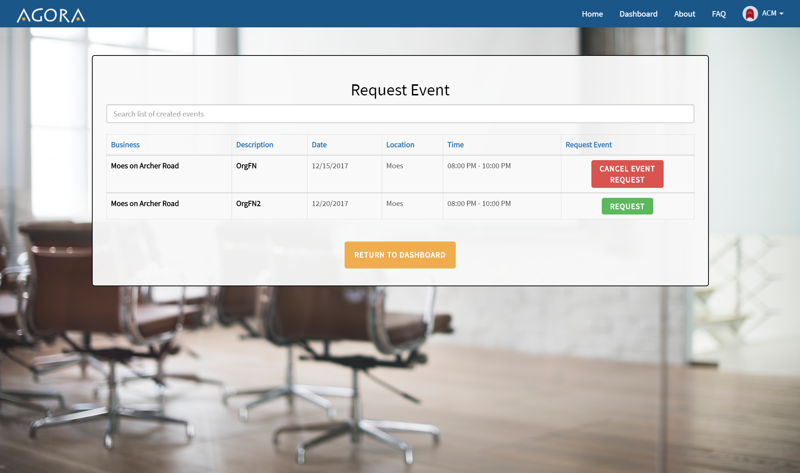

<h2>Deployed Project Page:</h2>
http://agora-fundraising.herokuapp.com
 
<h2>Implemented Features:</h2>
<h3>Landing page: Features buttons linking to the FAQ and About page</h3>

<h3>About page: tells the story of Agora and explains the mission of the website</h3>

<h3>FAQ page: Contains commonly asked questions and answers in a condensed accordian form</h3>

<h3>Business Dashboard: Shows the list of events that a business has created, and provides buttons to manage them</h3>

<h3>Event Creation: Provides the form for a business to create a new event</h3>

<h3>Organization Dashboard: Shows the list of events that organizations have requested, and provides buttons to delete the requests</h3>

<h3>Event Requesting: Shows a list of availible events that an organization can request</h3>

<h3>Calendar: Shows events associated with the account on a calendar</h3>

<h3>Past Events: Shows the details of the events that have occured in the past for a user</h3>

<h3>Notifications: Shows a user's notifications</h3>

 
<h2>How to Run Locally</h2>
<ol>
	<li>Clone the GitHub repository to your computer</li>
	<li>In the console, navigate to the project directory</li>
	<li>Run "npm install" in the console</li>
	<li>Run "node server" in the console</li>
	<li>In the browser of your choice, type "localhost:3000" in the address bar</li>
</ol>
 
<h2>How to Update Database Connection</h2>
<ol>
	<li>Register an account at mlab.com</li>
	<li>Create a new database</li>
	<li>Copy the URI for the database</li>
	<li>Navigate to config/env/ and open the development file</li>
	<li>In line 7 replace the green text with the copied URI</li>
</ol>
